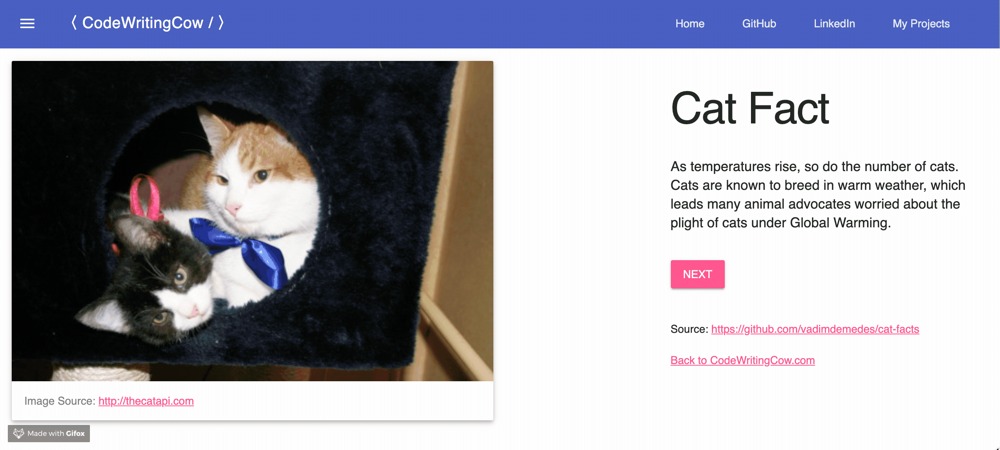

# Random Cat Photo Generator
This repository contains the source for an [AngularJS single-page application](https://garypang.dev/AngularJS-Cat-Facts/) that generates a random cat photo (and factoid) when the "NEXT" button gets clicked. MEOW! 🐈

## Requirements

#### Key Dependencies
- [AngularJS](https://angularjs.org/) web framework
- [Material Design Lite](https://getmdl.io/) front-end library
- [Material Icons](https://fonts.googleapis.com/icon?family=Material+Icons) style sheet

## Author
**Gary Pang** - [garypang.dev](https://garypang.dev)

## References
- [Interesting cat facts](https://github.com/vadimdemedes/cat-facts)
- [TheCatAPI](http://thecatapi.com)
